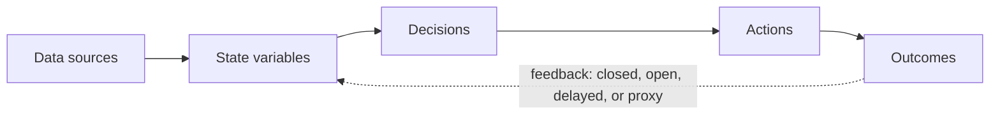

# World Model Mapping Output Template

Use this template to document findings from a mapping session.

---

## System Mapped

**Name:** [System/Module/Process Name]

**Scope:** [What specifically was analyzed]

**Primary Outcome:** [What this system should influence]

**Decision Makers:** [Who uses this system to make decisions]

**Date Mapped:** [Date]

---

## Phase 1: State Inventory

### Currently Tracked Variables

| Variable | Source | Refresh Rate | Leading/Lagging | Shadow/Reality |
|----------|--------|--------------|-----------------|----------------|
| | | | | |
| | | | | |
| | | | | |

### Missing State (Gaps Identified)

| Variable Needed | Why It Matters | Current Workaround | Priority |
|-----------------|----------------|-------------------|----------|
| | | | |
| | | | |
| | | | |

### Shadow → Reality Conversion Opportunities

| Current Shadow | Reality Alternative | Feasibility |
|----------------|---------------------|-------------|
| | | |
| | | |

---

## Phase 2: Action Map

### Decisions Enabled by This System

| Decision | Decision Maker | Trigger Condition | Current Latency | Automation Candidate? |
|----------|----------------|-------------------|-----------------|----------------------|
| | | | | |
| | | | | |
| | | | | |

### Unmapped Actions (Decisions Without System Support)

| Decision Made Today | State Needed | Why Not Currently Possible |
|--------------------|--------------|-----------------------------|
| | | |
| | | |

### Intervention Point Analysis

| State Change | Observable? | Actionable? | Value of Intervening |
|--------------|-------------|-------------|---------------------|
| | | | |
| | | | |

---

## Phase 3: Transition Model

### Predictions Being Made (Explicit or Implicit)

| Prediction | Confidence | Key Assumptions | Causal Chain Clarity |
|------------|------------|-----------------|---------------------|
| | | | |
| | | | |
| | | | |

### Brittleness Assessment

| Prediction | What Breaks It | Likelihood | Impact If Broken |
|------------|----------------|------------|------------------|
| | | | |
| | | | |

### Narrative vs. Optimization Check

| Current Approach | Type | Improvement Opportunity |
|------------------|------|------------------------|
| | Narrative / Optimization | |
| | | |

---

## Phase 4: Feedback Audit

### Feedback Loop Status

| Prediction | Feedback Mechanism | Time to Feedback | Loop Status | Notes |
|------------|--------------------|------------------|-------------|-------|
| | | | Closed / Open / Delayed / Proxy | |
| | | | | |
| | | | | |

### Domain Physics Identified

| Constraint | Type | Currently Encoded in System? |
|------------|------|------------------------------|
| | Hard / Soft | Yes / No |
| | | |
| | | |

---

## Synthesis

### Gap Report (Prioritized)

**Critical (Blocking core outcomes, fixable):**
1. 
2. 

**High (Significant impact, moderate effort):**
1. 
2. 

**Medium (Incremental improvement):**
1. 
2. 

**Low (Nice to have):**
1. 
2. 

### State Architecture Summary

### Key Insights

1. 
2. 
3. 

---

## Recommended Next Step

**What to do:** [Specific action]

**Why this first:** [Justification based on findings]

**Expected impact:** [What changes when this is done]

**Dependencies:** [What needs to happen before or alongside]

**Success metric:** [How to know it worked]

---

## Follow-Up Items

| Item | Owner | Due Date | Status |
|------|-------|----------|--------|
| | | | |
| | | | |

---

*Template version 1.0, World Model Mapper skill*

True North Data Strategies LLC | truenorthstrategyops.com
